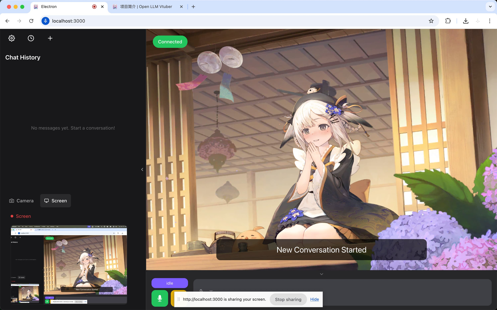
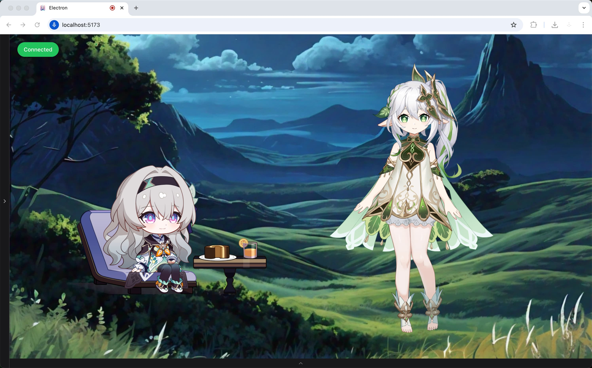

<h1 align="center">Open-LLM-VTuber</h1>
<h3 align="center">

 
 

 

[-pd93364606-white?style=flat&logo=qq&logoColor=white)](https://pd.qq.com/s/tt54r3bu)

Русский README | [English README](README.EN.md) | [中文README](README.CN.md)

[Documentation](https://open-llm-vtuber.github.io/docs/quick-start) | 

</h3>

> 常见问题 Common Issues doc (Written in Chinese): https://docs.qq.com/pdf/DTFZGQXdTUXhIYWRq
>
> User Survey: https://forms.gle/w6Y6PiHTZr1nzbtWA
>
> 调查问卷(中文): https://wj.qq.com/s2/16150415/f50a/

> :warning: Этот проект находится на ранней стадии разработки и активно развивается.

> :warning: Если вы хотите запустить сервер удаленно и получить доступ к нему с другого устройства, например, запустить сервер на компьютере и получить доступ с телефона, вам нужно настроить `https`, потому что микрофон на фронтенде будет работать только в безопасном контексте (т.е. https или localhost). См. [MDN Web Doc](https://developer.mozilla.org/en-US/docs/Web/API/MediaDevices/getUserMedia). Поэтому вам следует настроить https с обратным прокси для доступа к странице на удаленной машине (не localhost).

## ⭐️ Что это за проект?

**Open-LLM-VTuber** — это уникальный **голосовой ИИ-компаньон**, который не только поддерживает **общение в реальном времени** и **визуальное восприятие**, но также имеет оживленный **Live2D аватар**. Все функции могут работать полностью офлайн на вашем компьютере!

Вы можете относиться к нему как к своему личному ИИ-компаньону — хотите ли вы `виртуальную девушку`, `парня`, `милого питомца` или любого другого персонажа, он может оправдать ваши ожидания. Проект полностью поддерживает `Windows`, `macOS` и `Linux`, и предлагает два режима использования: веб-версия и десктопный клиент (с особой поддержкой **режима прозрачного фона для десктопного питомца**, позволяя ИИ-компаньону сопровождать вас везде на экране).

Хотя функция долгосрочной памяти временно удалена (скоро вернется), благодаря постоянному хранению журналов чата вы всегда можете продолжить предыдущие незавершенные разговоры, не теряя драгоценные моменты взаимодействия.

С точки зрения поддержки бэкенда, мы интегрировали богатое разнообразие решений для вывода LLM, преобразования текста в речь и распознавания речи. Если вы хотите настроить своего ИИ-компаньона, вы можете обратиться к [Руководству по настройке персонажа](https://open-llm-vtuber.github.io/docs/user-guide/live2d) для настройки внешнего вида и личности вашего ИИ-компаньона.

Причина, по которой он называется `Open-LLM-Vtuber` вместо `Open-LLM-Companion` или `Open-LLM-Waifu`, заключается в том, что первоначальной целью разработки проекта было использование открытых решений, которые могут работать офлайн на платформах, отличных от Windows, для воссоздания закрытого ИИ-витубера `neuro-sama`.

Этот проект прошел рефакторинг кода после версии `v1.0.0` и в настоящее время активно разрабатывается, с множеством захватывающих функций, которые скоро появятся! 🚀 Ознакомьтесь с нашим [Roadmap](https://github.com/users/t41372/projects/1/views/5), чтобы узнать о планах обновлений.

### 👀 Демо
|  |  |
|:---:|:---:|
|  |  |

## ✨ Возможности и особенности

- 🖥️ **Кросс-платформенная поддержка**: Идеальная совместимость с macOS, Linux и Windows. Мы поддерживаем NVIDIA и не-NVIDIA GPU, с возможностью запуска на CPU или использования облачных API для ресурсоемких задач. Некоторые компоненты поддерживают ускорение GPU на macOS.

- 🔒 **Поддержка офлайн режима**: Работает полностью офлайн, используя локальные модели — интернет не требуется. Ваши разговоры остаются на вашем устройстве, обеспечивая конфиденциальность и безопасность.

- 💻 **Привлекательные и мощные веб- и десктопные клиенты**: Предлагает как веб-версию, так и режим использования десктопного клиента, поддерживая богатые интерактивные функции и настройки персонализации. Десктопный клиент может свободно переключаться между оконным режимом и режимом десктопного питомца, позволяя ИИ-компаньону быть рядом с вами в любое время.

- 🎯 **Продвинутые функции взаимодействия**:
  - 👁️ Визуальное восприятие, поддерживающее камеру, запись экрана и скриншоты, позволяя вашему ИИ-компаньону видеть вас и ваш экран
  - 🎤 Голосовое прерывание без наушников (ИИ не слышит собственный голос)
  - 🫱 Тактильная обратная связь, взаимодействуйте с вашим ИИ-компаньоном через клики или перетаскивание
  - 😊 Live2D выражения, установите маппинг эмоций для управления выражениями модели из бэкенда
  - 🐱 Режим питомца, поддерживающий прозрачный фон, глобальное поверх всех окон и прохождение кликов мыши — перетащите вашего ИИ-компаньона куда угодно на экране
  - 💭 Отображение внутренних мыслей ИИ, позволяя вам видеть выражения, мысли и действия ИИ без их произнесения
  - 🗣️ Функция активной речи ИИ
  - 💾 Постоянство журналов чата, переключайтесь на предыдущие разговоры в любое время
  - 🌍 Поддержка перевода TTS (например, общение на китайском, пока ИИ использует японский голос)

- 🧠 **Обширная поддержка моделей**:
  - 🤖 Большие языковые модели (LLM): Ollama, OpenAI (и любой совместимый с OpenAI API), Gemini, Claude, Mistral, DeepSeek, Zhipu AI, GGUF, LM Studio, vLLM и др.
  - 🎙️ Автоматическое распознавание речи (ASR): sherpa-оннх, FunASR, Faster-Whisper, Whisper.cpp, Whisper, Groq Whisper, Azure ASR и др.
  - 🔊 Преобразование текста в речь (TTS): sherpa-onnx, pyttsx3, MeloTTS, Coqui-TTS, GPTSoVITS, Bark, CosyVoice, Edge TTS, Fish Audio, Azure TTS и др.

- 🔧 **Высокая настраиваемость**:
  - ⚙️ **Простая конфигурация модулей**: Переключайте различные функциональные модули через простые изменения конфигурационного файла, не углубляясь в код
  - 🎨 **Настройка персонажа**: Импортируйте пользовательские Live2D модели, чтобы придать вашему ИИ-компаньону уникальный внешний вид. Формируйте личность вашего ИИ-компаньона, изменяя Prompt. Выполняйте клонирование голоса, чтобы придать вашему ИИ-компаньону желаемый голос
  - 🧩 **Гибкая реализация Agent**: Наследуйте и реализуйте интерфейс Agent для интеграции любой архитектуры Agent, такой как HumeAI EVI, OpenAI Her, Mem0 и др.
  - 🔌 **Хорошая расширяемость**: Модульная конструкция позволяет легко добавлять собственные реализации LLM, ASR, TTS и других модулей, расширяя новые функции в любое время

## 👥 Отзывы пользователей
> Спасибо разработчику за открытый исходный код и обмен девушкой для всех

> Эта девушка использовалась более 100 000 раз

## 🚀 Быстрый старт

Пожалуйста, обратитесь к разделу [Быстрый старт](https://open-llm-vtuber.github.io/docs/quick-start) в нашей документации для установки.

## ☝ Обновление  
> :warning: `v1.0.0` имеет критические изменения и требует повторного развертывания. Вы *можете* все еще обновляться через метод ниже, но файл `conf.yaml` несовместим и большинство зависимостей нужно переустановить с `uv`. Для тех, кто пришел из версий до `v1.0.0`, я рекомендую развернуть этот проект снова с [последним руководством по развертыванию](https://open-llm-vtuber.github.io/docs/quick-start).

Пожалуйста, используйте `uv run update.py` для обновления, если вы установили любые версии позже `v1.0.0`.

## 😢 Удаление  
Большинство файлов, включая зависимости Python и модели, хранятся в папке проекта.

Однако модели, загруженные через ModelScope или Hugging Face, также могут быть в `MODELSCOPE_CACHE` или `HF_HOME`. Хотя мы стремимся держать их в директории `models` проекта, хорошо бы перепроверить.  

Просмотрите руководство по установке для любых дополнительных инструментов, которые вам больше не нужны, таких как `uv`, `ffmpeg` или `deeplx`.  

## 🤗 Хотите внести вклад?
Ознакомьтесь с [руководством по разработке](https://docs.llmvtuber.com/docs/development-guide/overview).

# 🎉🎉🎉 Связанные проекты

[ylxmf2005/LLM-Live2D-Desktop-Assitant](https://github.com/ylxmf2005/LLM-Live2D-Desktop-Assitant)
- Ваш Live2D десктопный ассистент, работающий на LLM! Доступен как для Windows, так и для MacOS, он чувствует ваш экран, извлекает содержимое буфера обмена и отвечает на голосовые команды уникальным голосом. Включает голосовое пробуждение, возможности пения и полный контроль компьютера для бесшовного взаимодействия с вашим любимым персонажем.

## 📜 Лицензии третьих сторон

### Уведомление о Live2D Sample Models

Этот проект включает Live2D примеры моделей, предоставленные Live2D Inc. Эти активы лицензированы отдельно в соответствии с Live2D Free Material License Agreement и Terms of Use for Live2D Cubism Sample Data. Они не покрываются MIT лицензией этого проекта.

Этот контент использует примеры данных, принадлежащие и защищенные авторским правом Live2D Inc. Примеры данных используются в соответствии с условиями, установленными Live2D Inc. (См. [Live2D Free Material License Agreement](https://www.live2d.jp/en/terms/live2d-free-material-license-agreement/) и [Terms of Use](https://www.live2d.com/eula/live2d-sample-model-terms_en.html)).

Note: For commercial use, especially by medium or large-scale enterprises, the use of these Live2D sample models may be subject to additional licensing requirements. If you plan to use this project commercially, please ensure that you have the appropriate permissions from Live2D Inc., or use versions of the project without these models.

## Contributors
Thanks our contributors and maintainers for making this project possible.

## Star History

 